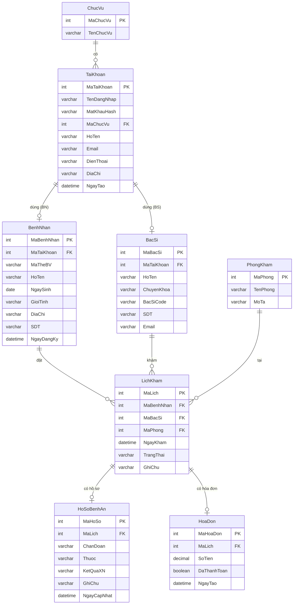

# BÁO CÁO MÔN HỌC LẬP TRÌNH WEB  
## Đề tài: Hệ thống quản lý bệnh viện

---

## Chương 1: TỔNG QUAN

### 1.1. Giới thiệu đề tài

**Tên đề tài:** Hệ thống quản lý bệnh viện (QuanLyBenhVien)

**Mục tiêu:** Xây dựng ứng dụng web hỗ trợ quản lý thông tin bệnh nhân, bác sĩ, lịch khám, hồ sơ bệnh án và hóa đơn trong môi trường bệnh viện. Hệ thống phân quyền theo vai trò (Quản lý, Bác sĩ, Nhân viên, Bệnh nhân) và cung cấp giao diện thân thiện cho từng đối tượng sử dụng.

**Phạm vi chức năng chính:**
- Đăng ký / đăng nhập, phân quyền theo chức vụ
- Quản lý bệnh nhân, bác sĩ, phòng khám
- Đặt lịch khám, cập nhật trạng thái lịch
- Quản lý hồ sơ bệnh án theo lịch khám
- Tạo và thanh toán hóa đơn

**Công nghệ sử dụng:** Backend Node.js (Express), Frontend React (Vite), cơ sở dữ liệu MySQL, xác thực JWT.

---

### 1.2. Cơ sở lý thuyết

- **Kiến trúc Client – Server:** Frontend (React) gửi HTTP request tới Backend (Express); Backend xử lý logic, truy vấn MySQL và trả JSON.
- **REST API:** Các endpoint theo chuẩn REST (GET, POST, PUT, DELETE) cho tài nguyên: `/api/auth`, `/api/benhnhan`, `/api/bacsi`, `/api/lichkham`, `/api/hoadon`, `/api/hosobenhan`.
- **Xác thực và phân quyền:** JWT (JSON Web Token) lưu ở client (localStorage), gửi kèm header `Authorization`; middleware kiểm tra token và vai trò (MaChucVu) trước khi cho phép truy cập API.
- **Cơ sở dữ liệu quan hệ:** Thiết kế chuẩn hóa với các bảng TaiKhoan, ChucVu, BenhNhan, BacSi, PhongKham, LichKham, HoSoBenhAn, HoaDon và quan hệ khóa ngoại tương ứng.
- **Bảo mật:** Mật khẩu băm bằng bcrypt; CORS cấu hình cho frontend; biến môi trường (.env) cho thông tin nhạy cảm.

---

## Chương 2: THIẾT KẾ HỆ THỐNG

### 2.1. Kiến trúc tổng quan

- **Frontend:** Ứng dụng SPA (Single Page Application) với React, React Router, Tailwind CSS, Framer Motion; gọi API qua Axios (baseURL cấu hình theo môi trường dev/production).
- **Backend:** Express.js, kết nối MySQL qua `mysql2/promise` (pool); các module tách thành routes, controllers, middleware (auth, role).

### 2.2. Thiết kế cơ sở dữ liệu

**Sơ đồ thực thể – quan hệ (ER Diagram):**

**Mô tả các bảng:**

- **ChucVu:** MaChucVu, TenChucVu (Quản lý, Bác sĩ, Nhân viên, Bệnh nhân).
- **TaiKhoan:** MaTaiKhoan, TenDangNhap, MatKhauHash, MaChucVu, HoTen, Email, DienThoai, DiaChi, NgayTao.
- **BenhNhan:** MaBenhNhan, MaTaiKhoan (FK), MaTheBV, HoTen, NgaySinh, GioiTinh, DiaChi, SDT, NgayDangKy.
- **BacSi:** MaBacSi, MaTaiKhoan (FK), HoTen, ChuyenKhoa, BacSiCode, SDT, Email.
- **PhongKham:** MaPhong, TenPhong, MoTa.
- **LichKham:** MaLich, MaBenhNhan, MaBacSi, MaPhong (FK), NgayKham, TrangThai, GhiChu.
- **HoSoBenhAn:** MaHoSo, MaLich (FK), ChanDoan, Thuoc, KetQuaXN, GhiChu, NgayCapNhat.
- **HoaDon:** MaHoaDon, MaLich (FK), SoTien, DaThanhToan, NgayTao.

### 2.3. Thiết kế API và phân quyền

- **Auth:** POST `/api/auth/dangnhap`, `/api/auth/dangky`, `/api/auth/reset-password`; GET `/api/auth/me`, `/api/auth/users` (chỉ quản lý).
- **BenhNhan:** CRUD và GET `/api/benhnhan/me` cho bệnh nhân đăng nhập.
- **BacSi:** CRUD (quản lý).
- **LichKham:** GET danh sách, GET theo bệnh nhân, POST đặt lịch, PUT cập nhật trạng thái.
- **HoSoBenhAn:** CRUD theo lịch/benh nhân.
- **HoaDon:** tạo, lấy theo lịch, cập nhật thanh toán.

Phân quyền: middleware `auth` (kiểm tra JWT), `permit(MaChucVu)` giới hạn theo vai trò (ví dụ chỉ MaChucVu = 1 mới được quản lý bác sĩ, bệnh nhân, hóa đơn).

### 2.4. Thiết kế giao diện và luồng người dùng

- **Trang công khai:** Trang chủ, Đăng nhập, Đăng ký, Đặt lại mật khẩu.
- **Bệnh nhân (role 4):** Trang BenhNhan – xem/thêm/sửa thông tin cá nhân, đặt lịch khám, xem lịch của mình.
- **Bác sĩ / Nhân viên (role 1, 2):** Trang BacSi – xem danh sách lịch, thao tác liên quan.
- **Quản lý (role 1):** Trang QuanLy – quản lý bệnh nhân, bác sĩ, lịch, hồ sơ, hóa đơn.

Route được bảo vệ bằng `ProtectedRoute` theo `roles` (ví dụ `roles={[4]}` cho bệnh nhân, `roles={[1,2]}` cho bac-si, `roles={[1]}` cho quan-ly).

---

## Chương 3: TRIỂN KHAI HỆ THỐNG

### 3.1. Môi trường và công cụ

- **Backend:** Node.js, Express, mysql2, dotenv, bcrypt, jsonwebtoken, cors.
- **Frontend:** Node.js, Vite, React, React Router DOM, Axios, Tailwind CSS, Framer Motion, React Toastify.
- **Cơ sở dữ liệu:** MySQL (script khởi tạo trong `newsql.sql`); hỗ trợ kết nối Railway (SSL, biến môi trường DB_*).

### 3.2. Triển khai Backend

- **server.js:** Khởi tạo Express, cors, express.json(); mount các route `/api/auth`, `/api/benhnhan`, `/api/bacsi`, `/api/lichkham`, `/api/hoadon`, `/api/hosobenhan`; endpoint `/api/health` kiểm tra hoạt động.
- **db.js:** Cấu hình pool MySQL từ biến môi trường (DB_HOST, DB_USER, DB_PASSWORD, DB_DATABASE, DB_PORT); bật SSL khi kết nối Railway.
- **Controllers:** Mỗi nghiệp vụ có controller riêng (ví dụ `lichkham.controller.js`: layTatCaLichKham, datLichKham, capNhatTrangThai, layLichTheoBenhNhan) dùng pool.execute với tham số hóa để tránh SQL injection.
- **Routes:** Định nghĩa method HTTP và path, gắn middleware auth/permit, gọi hàm controller tương ứng.
- **Auth:** Mã hóa mật khẩu (bcrypt), phát JWT khi đăng nhập; middleware auth giải mã JWT và gắn user vào req.

### 3.3. Triển khai Frontend

- **Điểm vào:** main.jsx bọc App bằng BrowserRouter và AuthContext (nếu có).
- **App.jsx:** Định nghĩa Routes (/, /dang-nhap, /dang-ky, /dat-lai-mat-khau, /reset-password, /benh-nhan, /bac-si, /quan-ly); các route nội bộ bọc bởi ProtectedRoute theo roles.
- **API:** Axios instance (api.js) với baseURL từ VITE_API_URL hoặc localhost:5050 (dev) / Railway (prod); interceptor thêm header Authorization từ localStorage.
- **Trang & component:** Home, DangNhap, DangKy, ResetPassword, BenhNhan, BacSi, QuanLy; các component dùng chung: Header, Footer, FormDatLich, TableDanhSach, MedicalRecord, ProtectedRoute.

### 3.4. Triển khai cơ sở dữ liệu

- Chạy script MySQL trong `newsql.sql` để tạo database, bảng và dữ liệu khởi tạo (ChucVu, có thể có tài khoản admin).
- Cấu hình .env backend với DB_HOST, DB_USER, DB_PASSWORD, DB_DATABASE, DB_PORT (và JWT secret nếu dùng).
- Frontend .env.production (hoặc biến môi trường build) đặt VITE_API_URL trỏ tới backend production (ví dụ Railway).

### 3.5. Bảo mật và vận hành

- Mật khẩu không lưu plain text; JWT có thời hạn; API nhạy cảm yêu cầu auth và permit.
- CORS cho phép origin frontend; biến nhạy cảm chỉ dùng ở server (.env).
- Có thể triển khai backend lên Railway (Dockerfile, railway.json, nixpacks.toml) và frontend lên Vercel/Netlify hoặc host tĩnh, cấu hình domain và biến môi trường tương ứng.

---

## Chương 4: KẾT LUẬN

### 4.1. Kết quả đạt được

- Hệ thống quản lý bệnh viện đã được xây dựng với đầy đủ phần backend (Node.js, Express, MySQL) và frontend (React, Vite), đáp ứng các chức năng cơ bản: đăng ký/đăng nhập, phân quyền, quản lý bệnh nhân – bác sĩ – lịch khám – hồ sơ bệnh án – hóa đơn.
- Kiến trúc tách lớp (routes, controllers, middleware), thiết kế API REST và cơ sở dữ liệu quan hệ giúp bảo trì và mở rộng thuận lợi.
- Giao diện thân thiện, phân quyền rõ ràng theo vai trò người dùng.

### 4.2. Hạn chế và hướng phát triển

- **Hạn chế:** Phạm vi đề tài giới hạn ở các nghiệp vụ cơ bản; chưa có báo cáo thống kê, in ấn, hoặc tích hợp thanh toán trực tuyến đầy đủ.
- **Hướng phát triển:** Bổ sung báo cáo thống kê (doanh thu, số lượt khám), in phiếu khám/hóa đơn, gửi email/SMS nhắc lịch, tối ưu hiệu năng và bảo mật (rate limit, refresh token), triển khai CI/CD và kiểm thử tự động.

---

## TÀI LIỆU THAM KHẢO

1. Express.js – Official documentation. https://expressjs.com/
2. React – Documentation. https://react.dev/
3. MySQL – Reference Manual. https://dev.mysql.com/doc/
4. JWT – Introduction to JSON Web Tokens. https://jwt.io/introduction
5. Vite – Guide. https://vitejs.dev/guide/
6. Tailwind CSS – Documentation. https://tailwindcss.com/docs
7. Axios – GitHub / documentation. https://github.com/axios/axios
8. Tài liệu môn học Lập trình Web – Trường/Khoa (ghi rõ nguồn theo quy định).

---

*Báo cáo được soạn theo cấu trúc: Chương 1 Tổng quan (Giới thiệu đề tài, Cơ sở lý thuyết), Chương 2 Thiết kế hệ thống, Chương 3 Triển khai hệ thống, Chương 4 Kết luận, Tài liệu tham khảo. Nội dung dựa trên mã nguồn dự án QuanLyBenhVien (backend Express, frontend React/Vite, MySQL).*
